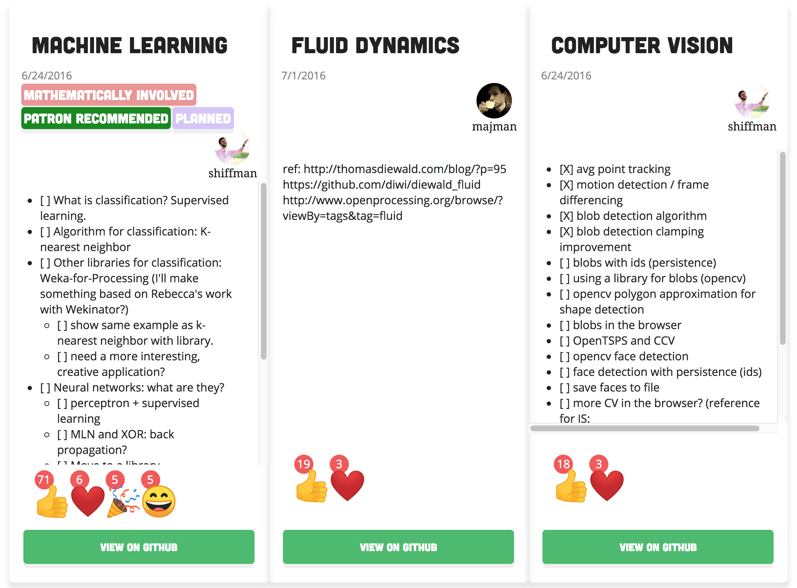
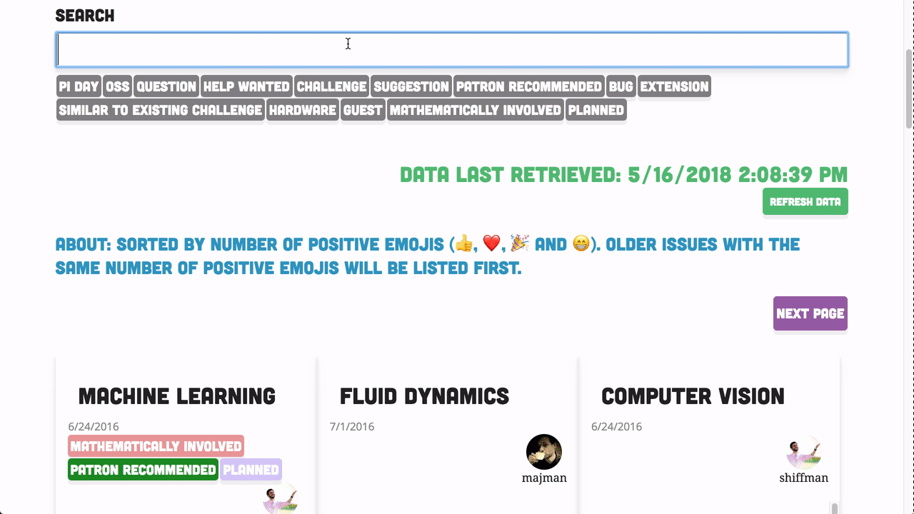
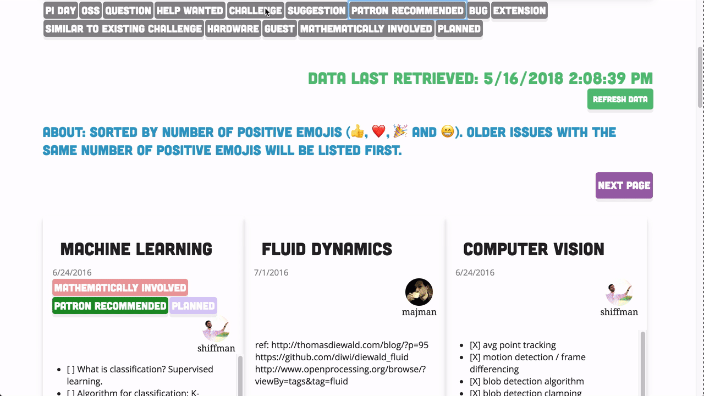

# Rainbow Topics Viewer

A sorted filterable view of the issues on the 🌈 Coding Train 🚂 [Rainbow Topics repo](https://github.com/CodingTrain/Rainbow-Topics/issues).

View it [here](https://rainbow-topics.now.sh/)

## Details

Built with Vue.js, Vuex and the Github API.

## How it works

1. Fetches all pages of issues with the github API and stores in `localStorage`
  * Issues will be loaded from localStorage until you press the `Refresh Data` button
  * If your IP reaches a rate limit, you can set `localStorage.GITHUB_ACCESS_TOKEN` to increase your limit.
    * Generate a token with public_repo access here: https://github.com/settings/tokens
2. Issues are sorted by number of positive reactions (👍, ❤️, 🎉 and 😁) and date.
3. Click a label under search to filter under only issues with that label.
  * Clicking multiple labels will only show issues with all labels selected.


### Sorted by positive reactions



### Filter



### View by Labels



## Local Setup

```sh
npm install
npm run serve
```
